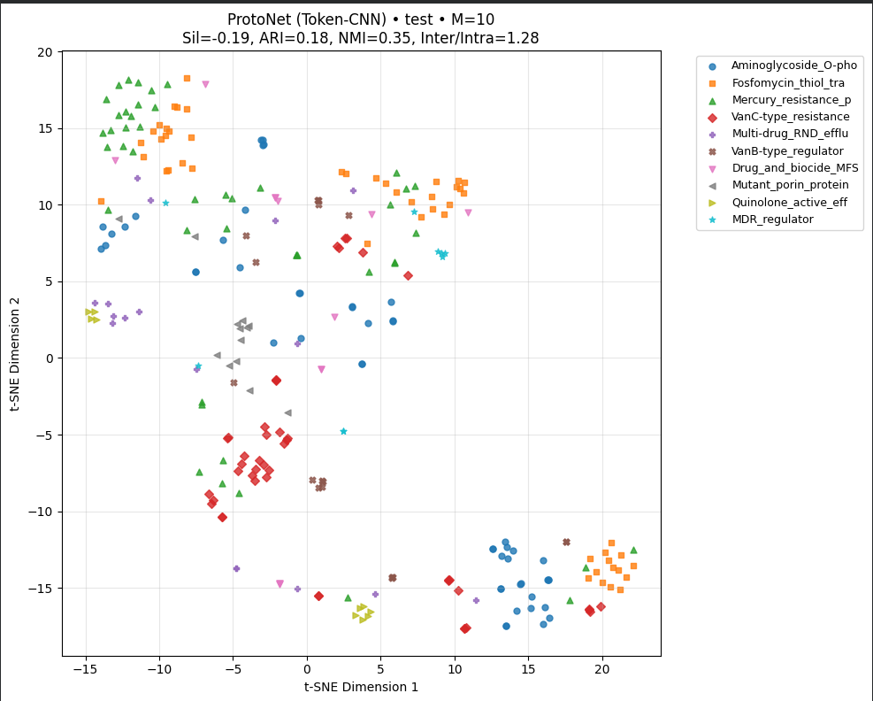

# ProtoMAML + Token-CNN Implementation:

* Performance: 64.4% test accuracy (vs 33.3% random baseline)
* Improvement: 93% over chance, nearly doubles baseline
* Key Metrics: Inter/Intra ratio 1.279, stable loss 1.011
* Consistency: Minimal overfitting (66.3% val vs 64.4% test)
  
* Technical Integration:
  - Inner Loop: Task-specific adaptation on support set
  - Outer Loop: Meta-update with gradient flow through adaptation
  - Second-order Gradients: Enable learning of adaptation strategy

* Additional Hyperparameters: Inner-loop LR and adaptation steps
* Advantage: Model learns how to adapt to new AMR mechanisms rather than just learning static representations.

